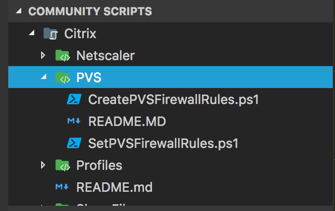
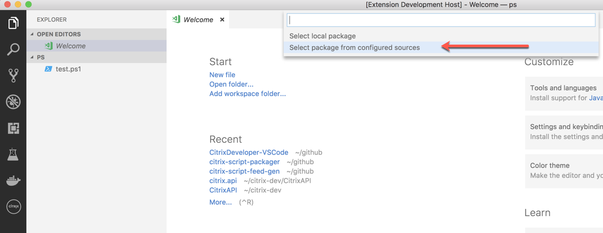
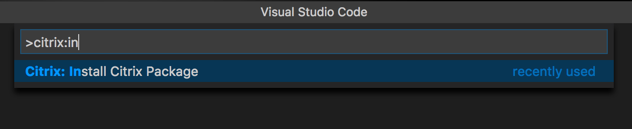
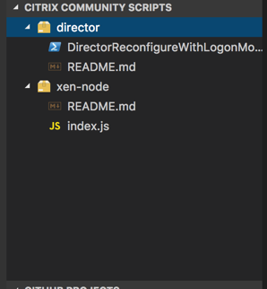
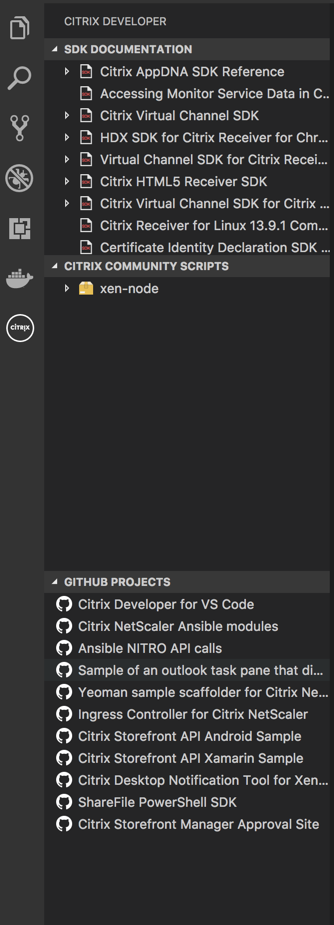

# CHANGE LOG

Release Notes for Citrix Developer Extension for Visual Studio Code

## Index

- [1.6.2](#162)
- [1.6.1](#161)
- [1.6.0 - 17th August, 2018](#160---17th-August-2018)
- [1.4.2](#142)
- [1.4.1 - 22nd June, 2018](#141---22nd-June-2018)
- [1.3.0 - 24th May, 2018](#130---24th-May-2018)
- [1.2.0](#120)
- [1.0.0 - 1st May, 2018](#100---1st-May-2018)
- [0.7.0](#070)
- [0.6.0](#060)
- [0.5.0 - 7th October, 2017](#050---7th-October-2017)

### 1.6.2

- Bug fixed for recursive directory creation on windows.
  - credit to [RyanCButler](http://www.twitter.com/Ryan_C_Butler) for identifying this bug.

### 1.6.1

- Added the ability to consume RSS feed _abd_ VSIX package hosted in a github repository
  
  ( _I think the line above includes a typo_ )

### 1.6.0 - 17th August, 2018

- Ability to show community scripts that have a folder structure in them. This allows the script packagers to create a single script with multiple product folders within it.

- Also updated the citrix-script-packager as well to coincide with this release. Please refer to that [repository](https://github.com/citrix/citrix-script-packager) for more information.

? ( _What happened to the 1.5 version releases or notes?_ ) ?

### 1.4.2

- Change the title of the "Citrix Community Scripts" to "Community Scripts" to encourage that this is for all types of community scripts, not just Citrix. If you build a script package, no matter what platform it targets, it will be surfaced here.

### 1.4.1 - 22nd June, 2018

- Settings to specify an RSS feed to list Citrix Script Packages
- Install Citrix Script package from a configured RSS source.

#### Video Tutorial

### 1.3.0 - 24th May, 2018

- Powershell Provider
- Script package installer

    Added the ability for the user to install a vsix script package built by the community. Please see [the Citrix Script Package project on github](https://github.com/citrix/citrix-script-packager) for more information on how to build these packages.

    

- Citrix Community Script Explorer View

    

### 1.2.0

- Moved the citrix based explorer views out into a new activity bar.

- Added multiple explorer views into the citrix activity bar to include the SDK Documentation, community script and [Citrix Github projects](https://www.github.com/citrix).

    

### 1.0.0 - 1st May, 2018

- Updated sdk doc list with new format
- added code to traverse and load the document subpages and add the interface references
- Formatted json file

- code cleanup

### 0.7.0

- Refactored the explorer view. Changed name to "Citrix Developer" and added additional nodes for SDK Documentation and Github Projects.

- Added github features to the listed open source projects, such as clone from url, open issues and open project site. This is shown in the context menu of the github node.

### 0.6.0

- Added Citrix Netscaler commands to the command palette for pulling/starting/stopping Netscaler CPX images.

### 0.5.0 - 7th October, 2017

- Initial release of the Citrix Developer tooling for VS Code.

- Explorer view added for SDK Links.
- SDK Links open a new window (or tab) in the systems default browser.
- Samples, snippets and scaffolding in process.
