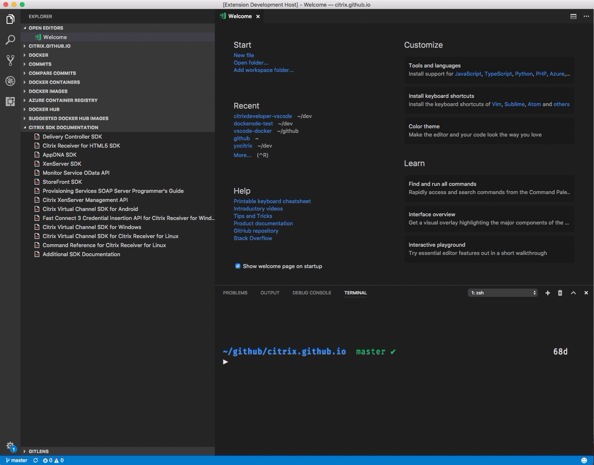
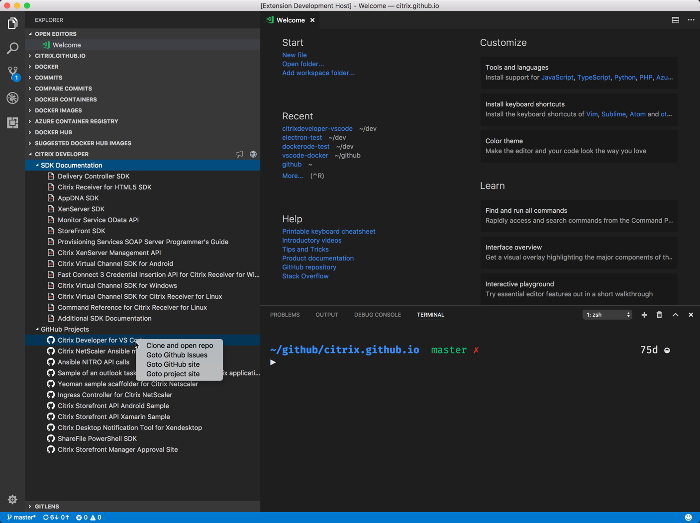

# Citrix Developer tools for Visual Studio Code

Citrix Developer tools for Visual Studio Code is an extension that helps developers build applications that target the Citrix platform by adding Samples, code snippets and SDK documentation to the IDE.

## Features

While this initial release in limited in features, the extension will support samples, code snippets, SDK documentation and project scaffolding. Below is the list of feature broken down by implemented versus on road map.

### Implemented

- [x] Explorer view to list SDK Documentation
- [x] Icon on view for developer.citrix.com site
- [x] Icon on view for  User feedback using UserVoice
- [x] Added Citrix commands to command palette to pull/start/stop netscaler CPX container from docker store
- [x] Merged Github and SDK Document into a single treeview for the developer explorer.
- [x] Add github samples to the new explorer view and give the user the ability to clone repo directly from the UI.

### On Roadmap

- [ ] Provide samples integration into the command pallet
- [ ] Code snippets for XenServer Citrix SDK
- [ ] Code snippets for Storefront SDK
- [ ] Code snippets for XenApp/XenDesktop Powershell
- [ ] Code snippets for Netscaler SDK
- [ ] Samples for XenServer Citrix SDK
- [ ] Samples for Storefront SDK
- [ ] Samples for XenApp/XenDesktop Powershell
- [ ] Samples for Netscaler SDK

## Using the extension

Install and open Visual Studio Code. Press Ctrl+Shift+X or Cmd+Shift+X to open the Extensions pane. Find and install the Citrix Developer extension.  The extension is now activated.

## Feedback

We are always interested in your feedback. You can either use our github issues or our [UserVoice](http://www.tinyurl.com/citrixuservoice) site for logging issues or requesting features. We monitor both.

## Known Issues

- Sites are open using the defaul browser. Would like to use the in-windows browser of VSCode.
- Samples not available yet.
- Snippets not available yet.

### 0.7.0

Refactored the explorer view. Changed name to "Citrix Developer" and added additional nodes for SDK Documentation and Github Projects.

Added github features to the listed open source projects, such as clone from url, open issues and open project site. This is shown in the context menu of the github node.

### 0.6.0

Added Citrix Netscaler commands to the command palette for pulling/starting/stopping Netscaler CPX images.

### 0.5.0

Initial release of Citrix Developer Extension for Visual Studio Code.
