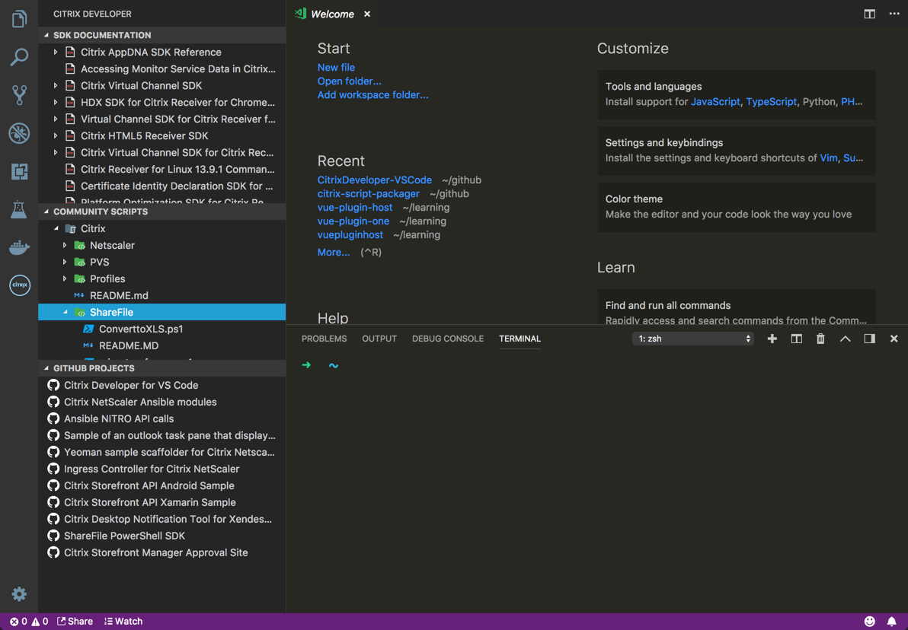

# Citrix Developer tools for Visual Studio Code

Citrix Developer tools for Visual Studio Code is an extension that helps developers build applications that target the Citrix platform by adding Samples, code snippets and SDK documentation to the IDE.

## Using the extension

Install and open Visual Studio Code. Press Ctrl+Shift+X or Cmd+Shift+X to open the Extensions pane. Find and install the Citrix Developer extension.  The extension is now activated. You can also download the extension manually from the marketplace [here](https://marketplace.visualstudio.com/items?itemName=CitrixDeveloper.citrixdeveloper-vscode).

## Feedback

We are always interested in your feedback. Please submit New [issues](issues) for logging issues or requesting features. We monitor both. If you would like to contact us directly you can use twitter [@citrixdeveloper](https://www.twitter.com/citrixdeveloper) or [@johnmcbride](http://www.twitter.com/johnmcbride)

## Roadmap

For roadmap based items, we will be utilizing the "feature" tag within the project issues along with the [Kanban board](projects/1).

## Known Issues

- Sites are open using the default browser. I would like to use the VSCode [Webview API](https://code.visualstudio.com/api/extension-guides/webview) instead.
- See [issue 25](issues/25)
- Samples not available yet.
- Snippets not available yet.

## Release Notes

See [CHANGELOG](CHANGELOG.md)
