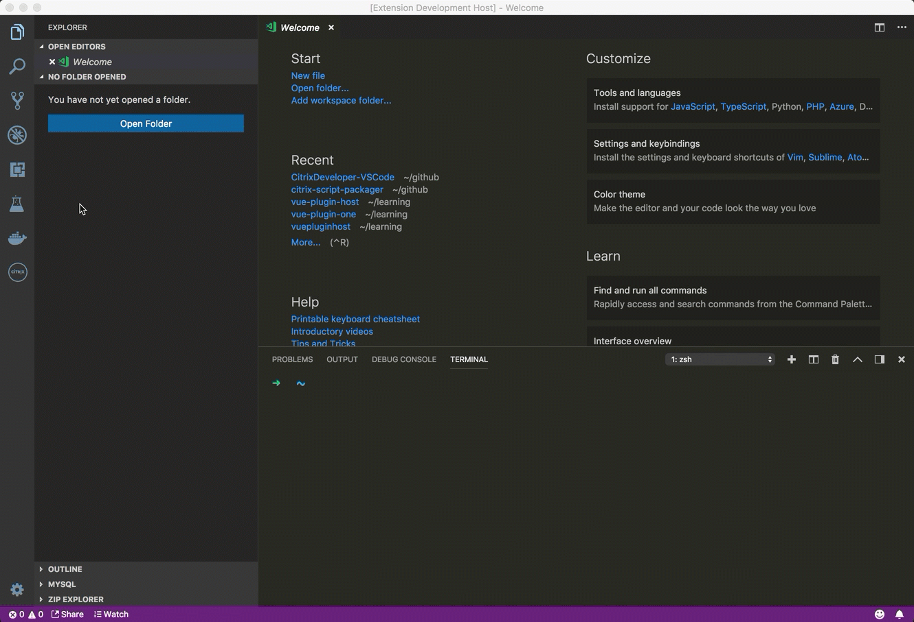
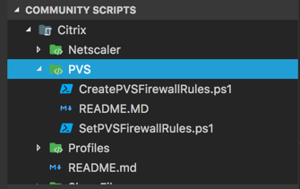

# Citrix Developer tools for Visual Studio Code

Citrix Developer tools for Visual Studio Code is an extension that helps developers build applications that target the Citrix platform by adding Samples, code snippets and SDK documentation to the IDE.

## Features

### Implement in this release (1.7.0)

- Implemented new project template system so that this extension can host project templates for users to create.

- Added Citrix Director plugin project template. This is available from the command pallet.

- Citrix Director Project Template

    - Custom build tasks in Visual Studio code for the following. These are located in the tasks.json file

        - Building project via the command pallet -> Build.

        - Packaging plugin into a deployment file via the command pallet -> Tasks option.

### Implemented in this release (1.6.2)

- Bug fixed for recursive directory creation on windows.
    * credit to [RyanCButler](http://www.twitter.com/Ryan_C_Butler) for identifing this bug.

### Implemented in release (1.6.1)

- Added the ability to consume RSS feed abd VSIX package hosted in a github repository

### Implemented in release (1.6.0)
- Ability to show community scripts that have a folder structure in them. This allows the script packagers to create a single script will multiple product folder within it.  

- Also updated the citrix-script-packager as well to coinscide with this release. Please refer to that [repository](https://github.com/citrix/citrix-script-packager) for more information.

### Implemented in this release (1.4.2)

- Change the title of the "Citrix Community Scripts" to "Community Scripts" to encourage that this is for all types of community scripts, not just Citrix. If you build a script package, no matter what platform it targets, it will be surfaced here.

### Implemented in this release (1.4.1)

- Settings to specify a RSS feed to list Citrix Script Packages
- Install Citrix Script package from a configured RSS source.

#### Video Tutorial

### Implemented in this release (1.3.0)

- Powershell Provider
- Script package installer
- Citrix Community Script Explorer

### On Roadmap

For roadmap based items, we will utilizing the "feature" tag within the project issues along with the kanban board.

## Using the extension

Install and open Visual Studio Code. Press Ctrl+Shift+X or Cmd+Shift+X to open the Extensions pane. Find and install the Citrix Developer extension.  The extension is now activated. You can also download the extension manually from the marketplace [here](https://marketplace.visualstudio.com/items?itemName=CitrixDeveloper.citrixdeveloper-vscode).

## Feedback

We are always interested in your feedback. Please submit New [issues](issues) for logging issues or requesting features. We monitor both. If you would like to contact us directly you can use twitter [@citrixdeveloper](https://www.twitter.com/citrixdeveloper) or [@johnmcbride](http://www.twitter.com/johnmcbride)

## Roadmap

For roadmap based items, we will be utilizing the "feature" tag within the project issues along with the [Kanban board](projects/1).

## Known Issues

- Sites are open using the default browser. I would like to use the VSCode [Webview API](https://code.visualstudio.com/api/extension-guides/webview) instead.
- See [issue 25](issues/25)
- Samples not available yet.
- Snippets not available yet.

## Release Notes

See [CHANGELOG](CHANGELOG.md)
