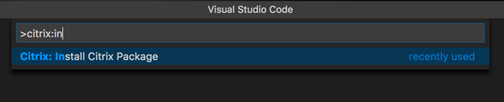
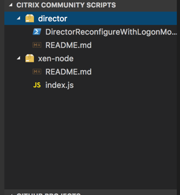
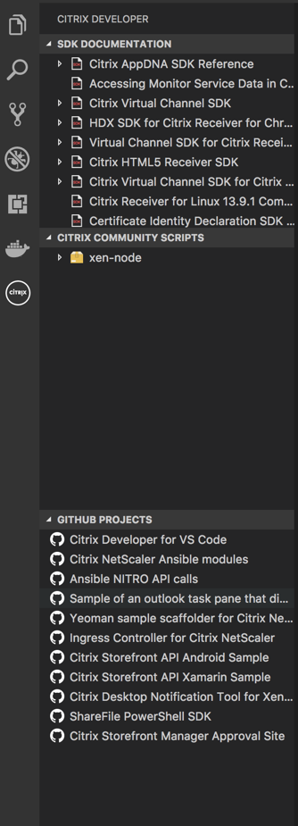

# Citrix Developer tools for Visual Studio Code

Citrix Developer tools for Visual Studio Code is an extension that helps developers build applications that target the Citrix platform by adding Samples, code snippets and SDK documentation to the IDE.

## Features

### Implemented in this release (1.4.1)

- Settings to specify a RSS feed to list Citrix Script Packages
- Install Citrix Script package from a configured RSS source.

#### Video Tutorial

### Implemented in this release (1.3.0)

- Powershell Provider
- Script package installer
- Citrix Community Script Explorer

### On Roadmap

For roadmap based items, we will utilizing the "feature" tag within the project issues along with the kanban board.

## Using the extension

Install and open Visual Studio Code. Press Ctrl+Shift+X or Cmd+Shift+X to open the Extensions pane. Find and install the Citrix Developer extension.  The extension is now activated. You can also download the extension manually from the marketplace [here](https://marketplace.visualstudio.com/items?itemName=CitrixDeveloper.citrixdeveloper-vscode).

## Feedback

We are always interested in your feedback. You can either use our github issues or our [UserVoice](http://www.tinyurl.com/citrixuservoice) site for logging issues or requesting features. We monitor both. If you would to contact us directly you can use twitter [@citrixdeveloper](https://www.twitter.com/citrixdeveloper) or [@johnmcbride](http://www.twitter.com/johnmcbride)

## Known Issues

- Sites are open using the defaul browser. Would like to use the in-windows browser of VSCode.
- Samples not available yet.
- Snippets not available yet.

## Version Information

### 1.3.0

Added the ability for the user to install a vsix script package built by the community. Please see [the Citrix Script Package project on github](https://github.com/citrix/citrix-script-packager) for more information on how to build these packages.

### 1.2.0

Moved the citrix based explorer views out into a new activity bar.

Added multiple explorer views into the citrix activity bar to include the SDK Documentation, community script and [Citrix based Github projects](https://www.github.com/citrix).

### 0.7.0

Refactored the explorer view. Changed name to "Citrix Developer" and added additional nodes for SDK Documentation and Github Projects.

Added github features to the listed open source projects, such as clone from url, open issues and open project site. This is shown in the context menu of the github node.

### 0.6.0

Added Citrix Netscaler commands to the command palette for pulling/starting/stopping Netscaler CPX images.

### 0.5.0

Initial release of Citrix Developer Extension for Visual Studio Code.
